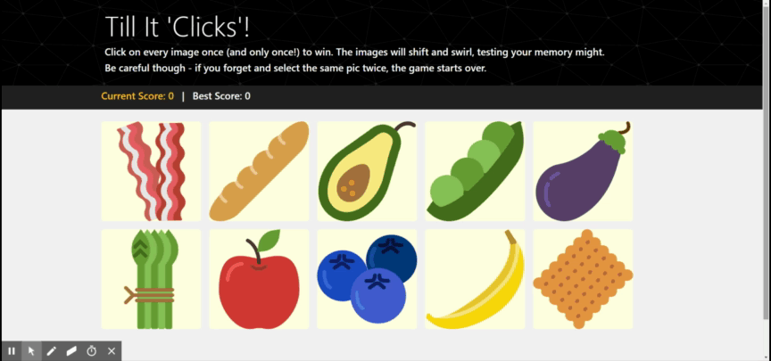

# Till It 'Clicks'
A simple browser-based memory game, implemented in React.

[https://kmtenhouse.github.io/clickygame/](https://kmtenhouse.github.io/clickygame/)

## How to Play
You will be presented with a set of images and invited to select them one at a time. Each time you make a selection, you receive one point -- but the board also shuffles!  

Your goal is to remember which ones you've already picked without hitting the same image twice, or the round is over.

**Try it live** at [https://kmtenhouse.github.io/clickygame/](https://kmtenhouse.github.io/clickygame/)!

## Sample Game Play

## Key Features 
* Never play with the same set of images twice!
* Challenge yourself by tracking your current score versus your best score

## Future Features
* Users can select their own difficulty level -- "easy" mode uses fewer images, "hard" mode includes more
* Users can make the game harder by setting all images to the same gray background

## Credits* 
* This project was bootstrapped with [Create React App](https://github.com/facebook/create-react-app)
* Food icons made by [Smashicons](https://smashicons.com/) from [Flaticon.com]https://www.flaticon.com/). Flaticon.com is licensed by [Creative Commons BY 3.0] (http://creativecommons.org/licenses/by/3.0/)
* Header background svg courtesy of [SVGBackgrounds.com](https://www.svgbackgrounds.com)